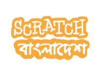

# Space Bubble Shooter
Welcome to the Space Bubble Shooter repository! This repository contains a game tutorial written in PDF format and a video recording (MP4) showcasing the gameplay. 

## About
Space Bubble Shooter is a game developed using Scratch. I created this repository to help my students who want to learn Scratch. The game tutorial in the PDF provides step-by-step instructions on how to create the game using Scratch.

## Contents
- [Game Tutorial PDF](game_in_scratch_part_01.pdf)
- [Gameplay Video](gameplay_video.mp4)
- [Presentation Manual](presentation-manual.txt)
 
## Usage
To get started with the game tutorial, download the PDF and follow the instructions (<i>Written in বাংলা</i>). You can also watch the gameplay video to get a visual understanding of how the game works.

## Sponsors

# Donate 
If you find value in what I'm creating,‌ a book donation would be a great choice.

> Happy coding :⁠-⁠), and enjoy playing Space Bubble Shooter!
